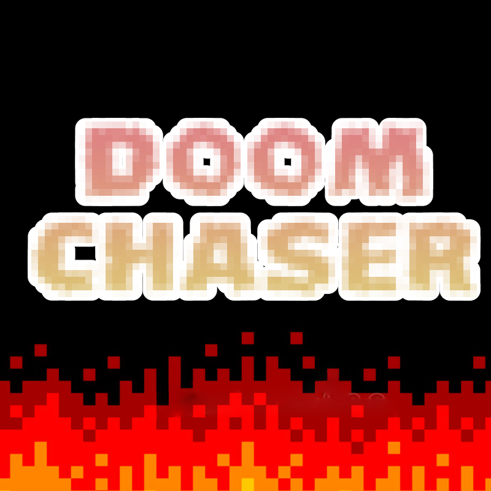
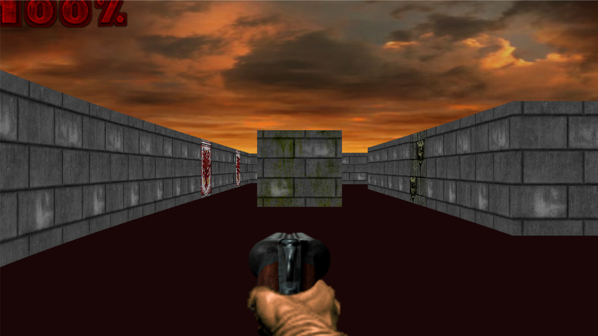
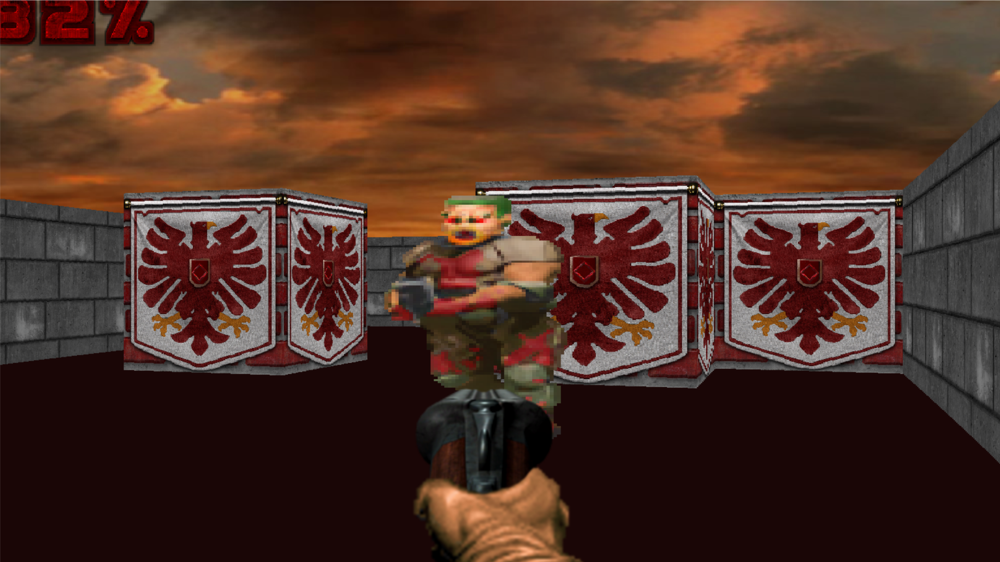
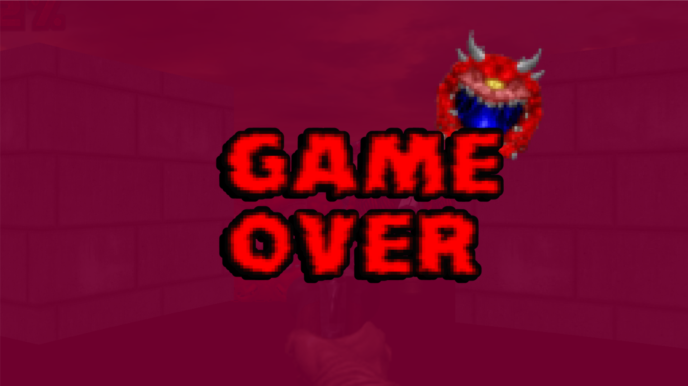

# DoomChaser: A Classic Doom-Inspired FPS 🚀🔫


**DoomChaser** is a first-person shooter game inspired by the classic **Doom** series, implemented in **Python** using **Pygame**. The game features a 3D raycasting engine, simple player and enemy mechanics, and immersive sound effects.

## Project Overview 🎯

**DoomChaser** is a retro-style FPS where players navigate a maze-like environment, fight enemies, and collect health while avoiding collisions with walls. The game uses a raycasting technique to render 3D environments from a 2D perspective.

## Project Components ⚙️

1. **Game Logic (main.py)**: Contains the core game loop, initialization, and event handling. Manages game states, player input, and overall game flow.

2. **Player Class (`player.py`)**:
   - Handles player movement, shooting, health management, and interaction with the game world.
   - Manages player animations and updates player state based on input and game events.

3. **Raycasting Engine (`raycast.py`)**:
   - Implements the raycasting algorithm to render the 3D environment.
   - Calculates the depth and projection of walls and objects for accurate visual representation.

4. **Sprites and Animations (`sprite_object.py` and `weapon.py`)**:
   - Manages static and animated sprites, including enemies and weapons.
   - Handles sprite animations and rendering based on game state and player actions.

5. **Sound Effects (`sound.py`)**:
   - Manages in-game sound effects and background music.
   - Handles loading and playing of various sound files for gameplay feedback.

6. **Settings (`settings.py`)**:
   - Contains configuration parameters for game settings like screen dimensions, player stats, and raycasting parameters.

## Features 🌟

- **First-Person Perspective**: Navigate through a 3D environment with a classic FPS view.
- **Player Mechanics**:
  - Move and rotate with keyboard controls.
  - Shoot with mouse clicks.
  - Manage health and reload weapons.
- **Raycasting Engine**:
  - Renders 3D walls and objects based on raycasting.
  - Avoids visual distortions with proper depth and projection calculations.
- **Enemy AI**: Simple enemies that react to player actions.
- **Animations**: Animated weapons and sprites for dynamic gameplay.

## Usage 🧑‍💻

1. **Download and Install Dependencies**:
   - Ensure **Pygame** is installed. You can install it via pip:
     ```bash
     pip install pygame
     ```

2. **Run the Game**:
   - Execute the game script using Python:
     ```bash
     python main.py
     ```

3. **Controls**:
   - **W**: Move forward
   - **A**: Move left
   - **S**: Move backward
   - **D**: Move right
   - **Mouse**: Look around and shoot
   - **Left Shift**: Sprint
   - **Left Ctrl**: Crouch
   - **Escape**: Quit the game

## Dependencies 📦

- **Pygame**: A set of Python modules designed for writing video games.
- **Python 3**: Ensure you have Python 3.x installed to run the game.

## Installation and Running the Game 🛠️

1. **Clone the Repository**:
    ```bash
    git clone https://github.com/your-username/doomchaser.git
    cd doomchaser
    ```

2. **Install Dependencies**:
    ```bash
    pip install pygame
    ```

3. **Run the Game**:
    ```bash
    python main.py
    ```

## Screenshots 📸









## Contributing 🫂

Contributions are welcome! Feel free to open issues or submit pull requests to enhance the game or fix bugs.

## Acknowledgements ⭐

- Special thanks to the creators of **Pygame** for providing a powerful and easy-to-use library for game development in Python.
- Inspired by the classic **Doom** series for its revolutionary gameplay and design.

